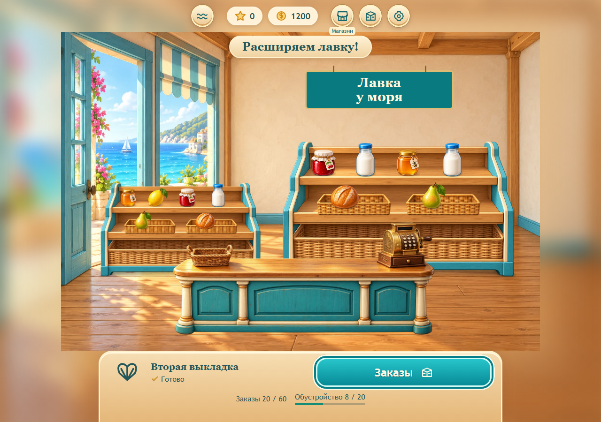

# Лавка у моря

Браузерная 2D-игра: сортировать товары по тройкам, выполнять заказы и строить торговый двор у моря. Для продолжения разработки начать с [HANDOFF.md](docs/HANDOFF.md).

**Полный первый выпуск:** 1800 заказов, 480 работ, шесть локаций и 24 этапа с возвращениями. Расчистка, подготовка площадок, строительство, оборудование и новые отделы дают постоянные изменения. [Производственный план](docs/CONTENT_MASTER_PLAN.md), [каталог всех работ](docs/CONTENT_CATALOG.md). Пакеты разработки являются внутренними этапами.

**Текущая реализация 0.4.0:** двадцать закреплённых заказов, восемь покупок первой лавки, две выкладки, карта, магазин помощи, оформление и совместимое сохранение. Цель первого этапа — 60 заказов/20 работ; всей лавки — 300/80. Остальные материалы предстоит произвести. Фактические правила — [GAME_DESIGN.md](docs/GAME_DESIGN.md).



## Запуск

Node.js 22.12+.

```sh
npm ci
npm run dev
```

Игра: http://localhost:5180. Мастерская заказов: `/author.html`. Предпросмотр сцены: `/campaign.html`.

```sh
npm test
npm run build
npm run preview
```

Production preview: http://localhost:4173. Требуется HTTP-сервер: открытие HTML как файла не поддерживает worker. Прогресс локальный; разные браузеры и host/port имеют разные сохранения.

## Разработка

- [HANDOFF.md](docs/HANDOFF.md) — фактическое состояние и ближайшие задачи.
- [CONTENT_MASTER_PLAN.md](docs/CONTENT_MASTER_PLAN.md) — объём полного продукта, стройка, экономика, системы и браузерные бюджеты.
- [CONTENT_CATALOG.md](docs/CONTENT_CATALOG.md) — 24 этапа, 480 работ с ценами, товары и персонажи.
- [GAME_DESIGN.md](docs/GAME_DESIGN.md) — реализованные правила, помощь и сохранения.
- [CONTENT.md](docs/CONTENT.md) — производство и проверка заказов/объектов.
- [art/ASSETS.md](docs/art/ASSETS.md) — ресурсы, исходники и упаковка.
- [QA.md](docs/QA.md) — результаты выполненных проверок и их ограничения.
- [RELEASE.md](docs/RELEASE.md) — подготовка полного первого выпуска.
- [AGENTS.md](AGENTS.md) — правила репозитория и работа в main.

Проверка плана: `npm run content:plan`. После изменения плана `node scripts/check-content-plan.mjs --write` обновляет каталог, отчёт и лёгкий runtime-каталог 24 этапов. Плановые места заказов не являются готовыми Definition. `npm run content:produce-shop` воспроизводимо готовит заказы второй выкладки и сохраняет уже закреплённые задачи.

Браузерные проверки: `npx playwright install chromium`, затем `npm run test:ui`. Они используют изолированный origin `127.0.0.1:4190`; не использовать его для личного прогресса. Временные результаты — в игнорируемом `artifacts`.

Сборка воспроизводит все готовые решения и считает всю папку dist: строго меньше 80 000 000 байт. Целевой бюджет полного продукта — 64 МБ. Runtime-ресурсы находятся в `public/assets`, исходники — в `docs/art` и `docs/reference`; документация и PNG-оригиналы в dist не входят.

С `?playtest=1` настройки позволяют экспортировать до 1000 событий текущей загрузки страницы. Журнал в памяти, без отправки в сеть.
