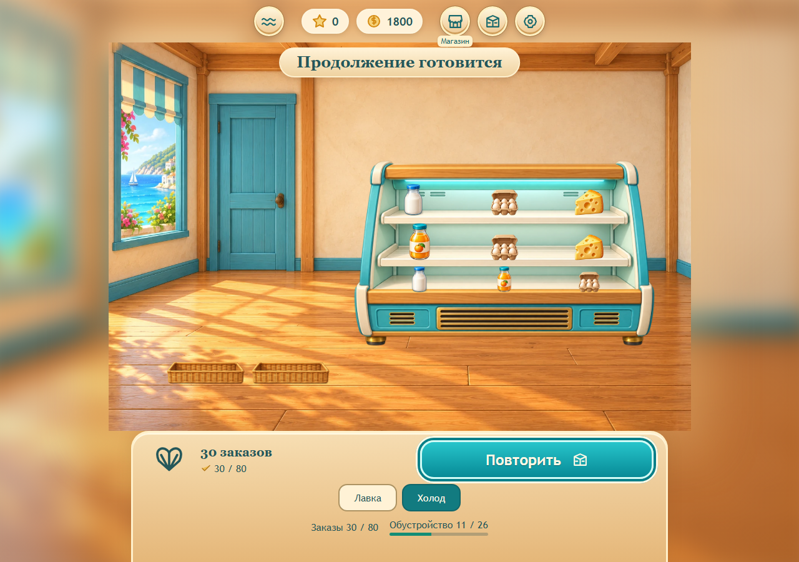

# Лавка у моря

Онлайн-браузерная 2D-игра для **Яндекс Игр**: сортировка товаров по тройкам, восстановление заброшенного прибрежного участка и развитие большого торгового двора. Цель продукта — долгосрочная игра с устойчивой аудиторией и коммерческой монетизацией. Референсы развития — Homescapes и Gardenscapes.

## Продолжение без контекста чата

Начать с [HANDOFF.md](docs/HANDOFF.md), затем прочитать [единое принятое направление и полный план](docs/CONTENT_MASTER_PLAN.md) и [реализованные правила](docs/GAME_DESIGN.md). Работать в `main` по [AGENTS.md](AGENTS.md). Все необходимые документы, исходники и ресурсы находятся в репозитории.

**Первый публичный выпуск:** 6000 заказов, шесть локаций по 1000, шесть глобальных Stage, 36 локальных этапов и 756 постоянных работ. Локальные этапы: 80 + 120 + 160 + 200 + 220 + 220. Новую территорию сначала очистить от мусора и старых конструкций, убрать растительность и пни, подготовить площадку, построить фундамент, стены, крышу, выполнить отделку и установить базовое оборудование. Только затем доступны её внутренние заказы. Строительные звёзды зарабатываются новыми заказами проекта в уже работающем здании.

Внутри глобального Stage игрок выбирает доступный проект: продолжить склад, вернуться в лавку или строить следующую локацию. Для следующего Stage завершить обязательные результаты всех введённых предприятий. Порядок каталога не является обязательной линейной выдачей заказов.

С первого публичного выпуска нужны ежедневные контракты, недельные проекты, коллекции, сезоны с бесплатной/платной дорожками, добровольная реклама, покупки, облако и аналитика. Кампания не требует покупки пропуска. Нативное мобильное приложение не разрабатывается; поддерживаются desktop и браузеры телефонов. Доход и удержание пока не измерены.

**Фактически в 0.5.0:** 30 закреплённых заказов, 11 покупок, торговый зал и холодный отдел, девять товаров, карта и совместимое локальное сохранение. Глобальные Stage, ветвление, стройка и сезоны ещё не реализованы. Цель первой лавки I уже отражена в плановом каталоге как 80/26; текущие 30/11 её не закрывают.

**Ближайший крупный блок реализации:** полные Stage 1–2, 600 заказов и 138 работ — лавка I, новый склад I, затем выбор лавки II, склада II и фруктового двора I–II. Это внутренняя готовность, а не отдельный публичный выпуск.



## Запуск и проверка

Node.js 22.12+.

```sh
npm ci
npm run dev
```

Игра: http://localhost:5180/. Мастерская: `/author.html`. Предпросмотр сцены: `/campaign.html`. Работать через HTTP; worker не поддерживает открытие HTML как локального файла.

```sh
npm run content:plan
npm test
npm run build
npx playwright install chromium
npm run test:ui
```

Production preview: `npm run preview` → http://localhost:4173/. UI-тесты используют отдельный origin `127.0.0.1:4190`. Сохранения разных host/port и браузеров пока раздельные; облака нет.

`node scripts/check-content-plan.mjs --write` пересобирает каталог, отчёт и лёгкие runtime-цели из производственного JSON. `npm run content:produce-shop` воспроизводит только уже подготовленную нынешнюю серию; он не создаёт автоматически весь будущий каталог. Закреплённые Definition сохраняются.

Весь dist должен оставаться **строго меньше 80 000 000 байт**, целевой полный пакет 64 МБ. Исходные PNG, документация и большой производственный план вне dist. Все ресурсы — внутри репозитория.

## Документы

- [CONTENT_MASTER_PLAN.md](docs/CONTENT_MASTER_PLAN.md) — цель, объём, стадии, стройка, экономика, монетизация, архитектура и критерии готовности.
- [CONTENT_CATALOG.md](docs/CONTENT_CATALOG.md) — 36 этапов, 756 работ, цены, зависимости и товары; автоматически из [full-product-plan.json](docs/content/full-product-plan.json).
- [GAME_DESIGN.md](docs/GAME_DESIGN.md) — поведение фактически реализованной игры.
- [CONTENT.md](docs/CONTENT.md) — производство и проверка заказов и сцен.
- [QA.md](docs/QA.md) — выполненные проверки и ограничения.
- [RELEASE.md](docs/RELEASE.md) — SDK, облако, монетизация и полный выпуск.
- [ASSETS.md](docs/art/ASSETS.md) — ресурсы, задания, исходники и упаковка.

С `?playtest=1` можно экспортировать до 1000 локальных событий текущей загрузки страницы. Это средство наблюдений, не серверная аналитика.
