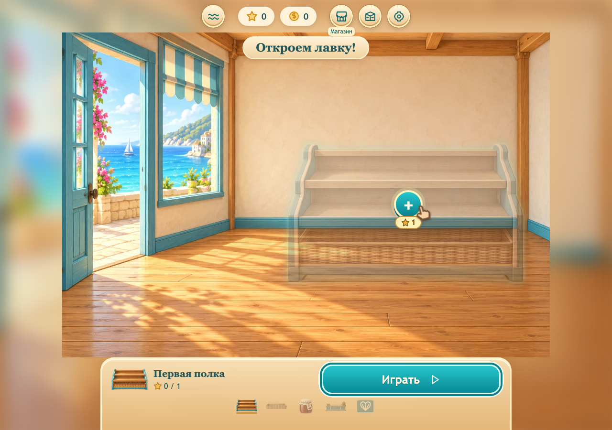

# Лавка у моря

Для продолжения на другом устройстве начать с [HANDOFF.md](docs/HANDOFF.md): там сохранены решения последнего обсуждения, итерации карты, состав ресурсов, граница готовности, команды запуска и сообщение для нового чата.

Браузерная игра сортировки товаров. Версия **0.3.0** — первый игровой срез кампании: десять заказов, пять шагов обустройства и финал «Лавка открыта!». Основной цикл и мастерская контента готовы; фактические проверки и оставшиеся задачи — в [QA.md](docs/QA.md).

Принятое направление развития — превратить пустую маленькую лавку в торговый двор у моря: открыть склад, расширить магазин, построить пекарню, террасу и ресторан на втором этаже. По примеру Homescapes и Gardenscapes игрок видит большую цель, ближайшую задачу и постоянный результат покупок. Реализация остаётся **2D**: общая карта и отдельные сцены с фиксированным ракурсом, фоном и независимыми спрайтами. План, темп, размер и первый этап — в [CAMPAIGN_PLAN.md](docs/CAMPAIGN_PLAN.md).

Карта участка и пустая лавка подключены к игре. На месте ближайшей покупки видны полупрозрачный предмет, маркер и цена. Нажатие начинает заказ; когда звёзд хватает, тот же маркер устанавливает предмет. Победы оплачивают полку, корзины, ассортимент, прилавок и открытие; после открытия видна цель склада. Шесть направлений показаны прямо на карте, играбельна только первая глава. Отдельный `campaign.html` остаётся визуальной мастерской для сравнения состояний без изменения прогресса. [Описание набора и слоёв](docs/art/CAMPAIGN_VISUALS.md).



Актуальный интерфейс: [начало на 360 px](docs/screenshots/campaign-live-empty-360.png), [карта участка](docs/screenshots/campaign-live-map-desktop.png), [финал на 360 px](docs/screenshots/campaign-live-finale-360.png), [магазин помощи на 360 px](docs/screenshots/campaign-live-tools-store-funded-360.png).

## Запуск

Нужен Node.js 22.12+.

```sh
npm ci
npm run dev
```

Игра: http://localhost:5180. Мастерская: http://localhost:5180/author.html. Предпросмотр кампании: http://localhost:5180/campaign.html.

```sh
npm test
npm run build
npm run preview
```

Production preview: http://localhost:4173; предпросмотр кампании — http://localhost:4173/campaign.html. Сервер должен оставаться запущенным; при занятом порте Vite остановится. Для публикации используется содержимое `dist`. Открытие HTML как файла не поддерживается: worker требует HTTP.

## Игра

Выбрать товар, затем свободное место, либо перетащить его. Три одинаковых товара на полке отправляются в заказ. Полоса «Запас» показывает количества товаров во всех скрытых рядах: следующий ряд раскрывается, когда передний полностью пуст. Замок открывается после нужного числа троек. В первой главе нет таймера и лимита ходов.

Один и тот же товар сохраняет размер при переносе между обычной полкой и полкой с запасом. Высота передней выкладки одинакова; появление и исчезновение плашки запаса не меняют масштаб товаров. Запас отображается отдельной строкой под своей полкой в обеих ориентациях. Кнопка «Лоток» превращается в лоток для одного товара прямо на своём месте, сохраняя размер поля. «Смешать» меняет расстановку открытых товаров. Все десять заказов имеют проверенные решения обычными переносами; эти инструменты — дополнительная помощь. Их покупают за монеты на отдельном экране «Магазин помощи», доступном из лавки и заказа. В игре расходуется запас использований; если он пуст, кнопка ведёт в магазин и сама монеты не списывает.

Только первый заказ обучает через затемнение «Возьми → Сюда» и ограничение кликов. При первом прохождении заказов 2–3, 7 и 9 золотая обводка мягко подсказывает товар, затем место переноса до победы: экран остаётся светлым, любые допустимые ходы доступны. Раскрытие первого ряда не завершает сопровождение. После самостоятельного хода или отмены следующий шаг проверяется заново. На четвёртом золотая рамка знакомит с бесплатной кнопкой помощи; ручные подсказки также обходятся без затемнения. Поддерживаются мышь, Pointer Events и Tab/Enter. Низкие окна прокручиваются, сохраняя размер поля.

Новая победа даёт 60 монет и одну звезду. Пять покупок стоят 1 + 2 + 2 + 2 + 3 звезды; наград десяти заказов хватает на всю главу. После финала доступны осмотр лавки, бесплатная смена цвета и повторы. Подробные правила, помощь и экономика — в [GAME_DESIGN.md](docs/GAME_DESIGN.md).

Оформление переключается отчётливыми вкладками; цвет выбирается радиокнопкой с предпросмотром и сохраняется через «Применить цвет». Закрытие отменяет предпросмотр. Основной текст в игре и мастерской — не меньше 16 px; на маленьком экране элементы перестраиваются и при необходимости прокручиваются.

Лавка занимает игровой экран: сверху кошелёк и круглые кнопки, в сцене ближайшая цель, снизу одна основная кнопка и пять значков развития. Для начала и покупки не требуется читать отдельные карточки или открывать предпросмотр. Результат заказа показывает будущий предмет и позволяет поставить его сразу. Купленный предмет становится непрозрачным, акцент переходит к следующему. Когда завершены все заказы и пять изменений — финал с целью склада.

На телефоне поддерживаются обе ориентации, без заглушки поворота. В portrait панель лавки снизу, в коротком landscape — сбоку; сцена сохраняет пропорции 3:2. Поле сортировки на 360 × 640 помещает три ряда полок вместе с управлением и резервом; на 640 × 360 полки перестраиваются в два ряда по три. Поворот сохраняет задачу и ход игры. Очень низкие окна используют прокрутку вместо уменьшения мест переноса меньше 44 px. Реальные телефоны ещё требуют проверки.

Прогресс сохраняется локально. Разные host/port и браузеры имеют разные профили. Ключ `coastal-shop:progress:v1`, schema 3; schema 1/2 мигрируют без изменения баланса и закреплённой задачи. Старые предметы и цвета сохраняются, полностью завершённая демоглава засчитывает все пять шагов. Для QA использовать отдельный origin, не сбрасывать пользовательский прогресс.

## Разработка и контент

- [HANDOFF.md](docs/HANDOFF.md) — состояние проекта и следующие задачи.
- [CAMPAIGN_PLAN.md](docs/CAMPAIGN_PLAN.md) — целевая 2D-кампания, развитие участка и порядок реализации.
- [GAME_DESIGN.md](docs/GAME_DESIGN.md) — реализованные правила и технические ограничения.
- [CONTENT.md](docs/CONTENT.md) — добавление заказов, товаров и ремонтов.
- [QA.md](docs/QA.md) — результаты, размеры окон и непроверенные сценарии.
- [RELEASE.md](docs/RELEASE.md) — подготовка к платформенному выпуску.
- [AGENTS.md](AGENTS.md) — правила работы в репозитории, включая работу в `main`.

Глава закреплена в `src/levels/chapter.json`, каталог — в `src/content.ts`. `src/engine.ts` содержит правила и проверку решений; `src/generator.ts` — генератор coastal-slice-2. `src/campaign.ts` содержит каталоги глав, зон и пяти покупок; `src/campaign-scene.ts` и общая CSS-композиция собирают сцену по купленным id. `src/world.ts` / `src/campaign-game.css` показывают лавку, визуальную цель и карту. `src/storage.ts` отвечает за попытки, награды и миграции; `src/tools.ts` — за каталог и пополнение помощи, `src/tool-shop.css` — за её магазин; `src/jobs.ts` и `src/worker.ts` — за поиск вне UI. `src/guidance.ts` выбирает режим обучения и считает скрытый запас; `src/hints.ts` сокращает проверенный путь помощи с повторным воспроизведением. Игровые экраны находятся в `src/main.ts` и `src/style.css`; мастерская — в `src/author.ts` и `src/author.css`.

Каждая сборка проверяет TypeScript, воспроизводит все решения главы и проверяет стоимость ремонта. Вся папка `dist`, включая worker и ассеты, должна быть меньше 80 000 000 байт. Отчёты: [контент](docs/content-report.json), [размер](docs/build-size.json). Дополнительная выборка генератора: `npm run content:audit`, [отчёт](docs/generator-report.json).

Все runtime-ресурсы находятся в `public/assets`, исходные PNG — в `docs/art`, исходные материалы — в `docs/reference`. Для сборки не нужны Python, прежний чат, папки Codex или внешний сервер. Необязательная перепаковка изображений описана в [ASSETS.md](docs/art/ASSETS.md).

Браузерные проверки: после `npm ci` один раз установить Chromium через `npx playwright install chromium`, затем `npm run test:ui`. Команда собирает production и запускает изолированные профили на 127.0.0.1:4190 для desktop и 360 px; временные снимки и traces находятся в `artifacts/ui`. Этот порт не использовать для пользовательской игры. Настройка — [Playwright](https://playwright.dev/docs/test-configuration).

С `?playtest=1` настройки позволяют скачать последние 1000 событий текущей загрузки страницы. Журнал хранится в памяти и не отправляется в сеть. SDK, реклама, платежи и облако подключаются отдельными этапами.
