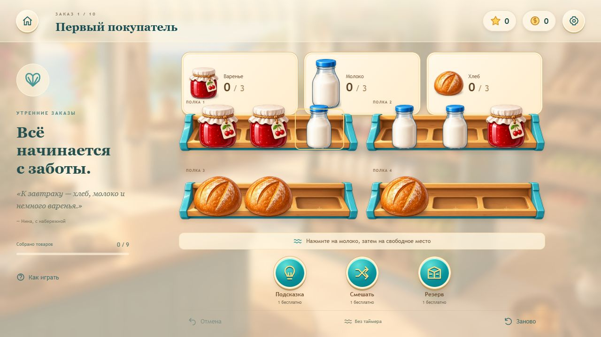

# Лавка у моря

Играбельный первый срез браузерной сортировки товаров: десять заказов, развитие прибрежной лавки и ремонт вывески. Версия 0.1.0. Реальная реклама, покупки и Яндекс SDK пока не подключены.

## Запуск

Нужен Node.js 22.12+ или совместимая новая версия. Проверено на Node.js 22.17.0.

```sh
git clone https://github.com/fellsia2019/2d-game-lavka.git
cd 2d-game-lavka
npm ci
npm run dev
```

Открыть http://localhost:5173. Сервер использует фиксированный порт. Если проект уже открыт, выполнять команды начиная с `npm ci` из корня проекта.

```sh
npm test
npm run build
npm run preview
```

Предпросмотр готовой сборки: http://localhost:4173. Публикуется содержимое `dist`, а не весь проект. Каждая сборка проверяет фактический размер всех файлов `dist`, сохраняет `docs/build-size.json` и завершается ошибкой при превышении внутреннего бюджета 80 000 000 байт.

`npm run preview` работает, пока запущен его процесс. Если соединение или терминал были закрыты и страница перестала отвечать, выполнить эту команду снова и обновить вкладку. При занятом порте Vite завершается с понятной ошибкой; другой порт сам не выбирает. Локальное сохранение принадлежит браузеру и origin, оно не хранится в Git.



## Продолжение разработки без старого чата

Репозиторий самодостаточен: исходный код, runtime ассеты, исходники изображений, материалы исследования, текущие правила и свидетельства проверки находятся здесь. Для запуска, тестов и сборки не нужны прежний чат, папки Codex, image_gen, Python или сервер документов.

Сначала прочитать [docs/HANDOFF.md](docs/HANDOFF.md) — что закончено и откуда продолжать. Текущий игровой дизайн описан в [docs/GAME_DESIGN.md](docs/GAME_DESIGN.md); правила работы агента сохранены в [AGENTS.md](AGENTS.md). Старые HTML и демонстрация генератора лежат в [docs/reference](docs/reference/README.md) как сохранённые источники. Они не исполняются приложением и не являются скрытой зависимостью сборки. При расхождении правил среза с ранними материалами актуальное поведение описано в GAME_DESIGN и реализовано в `src`.

Интернет нужен для первоначального `npm ci` и обычных Git операций. Vite, TypeScript и тестовый runner — локальные зависимости разработки, закреплённые lockfile. Готовая игра не использует внешние CDN, шрифты, API или файлы из чужой папки. Официальные ссылки в RELEASE — справочные источники для следующего этапа. Python + Pillow нужны только для необязательной перепаковки исходных изображений; готовые WebP уже включены в репозиторий.

## Как играть

Нажать на видимый товар, затем на свободное место; также работает перетаскивание. Три одинаковых товара в переднем ряду одной полки автоматически отправляются в заказ. Пустой передний ряд раскрывает следующий, а закрытая поставка открывается после указанного числа троек. Победа — доставка всех требуемых товаров. В главе нет таймера и ограничения ходов.

Отмена и перезапуск бесплатны. История отмены хранит последние 30 состояний. Подсказка показывает следующий проверенный ход. Перемешивание меняет только открытые передние ряды и применяется лишь после проверки решения. Резерв добавляет одно место на текущую попытку. В подарок выданы две подсказки, одно перемешивание и один резерв; затем они стоят 100 / 200 / 300 игровых монет. Потраченная помощь не возвращается при перезапуске. После перемешивания или добавления резерва история отмены сбрасывается, чтобы помощь нельзя было отменить и продублировать.

Новый заказ даёт 60 монет и одну звезду ремонта. Вывеска стоит три звезды; после открытия любой из трёх цветов можно менять бесплатно. Повторное прохождение даёт 10 монет, без звезды, не более десяти награждённых повторов в сутки по локальному календарю. Это параметры среза для дальнейшей проверки баланса.

Управление с клавиатуры: Tab — переход между кнопками, Enter — выбор и перенос, Escape — снять выбор или закрыть обычный диалог. Настройки раздельно управляют эффектами, фоновой мелодией и уменьшением движения. Звук включается после первого пользовательского действия и приостанавливается при потере фокуса или скрытии страницы.

## Устройство проекта

TypeScript + Vite без библиотек в runtime. Для небольшого поля DOM и CSS дают лёгкую 2.5D сцену, чёткий адаптивный интерфейс и доступные кнопки; текстурные WebP спрайты обеспечивают объём товаров. Не нужен отдельный рендерер для десяти заказов. При росте количества объектов можно заменить слой отображения, сохранив чистое ядро.

- `src/engine.ts` — правила, каскады, неизменяемые переносы, поиск и проверка решений.
- `src/generator.ts` — seed, четыре семейства, ограниченный generate-and-test, структурное сравнение задач, проверенное перемешивание.
- `src/content.ts` — три ручных обучающих задания и семь отобранных seed; десять задач имеют различные структуры даже при переименовании товаров.
- `src/worker.ts`, `src/jobs.ts` — генерация и поиск вне UI потока, отдельный worker на запрос, ограничение 12 секунд и завершение worker.
- `src/storage.ts` — версия сохранения, закреплённая задача, текущее поле, отмена, награды, ремонт и настройки.
- `src/main.ts`, `src/style.css` — лавка, головоломка, результат, диалоги, мышь/Pointer Events/клавиатура, анимация переноса и отправки.
- `src/audio.ts` — короткие синтезированные эффекты и тихая мелодия через Web Audio; внешних аудиофайлов нет.
- `public/assets` — шесть отдельных товаров, пустая полка и интерьер.
- `tests/core.test.ts` — проверка правил, генерации, сохранения и экономики.

Для одинаковых seed, профиля и версии `coastal-slice-1` результат одинаков. Принятие кандидата зависит от числа узлов поиска, а не скорости компьютера. Каждый принятый уровень содержит решение, воспроизведённое до победы. Неудачный ограниченный поиск означает «не подтверждено»; такой уровень игроку не выдаётся. Длина найденного пути не объявляется минимальной или мерой интереса.

Сохранение `coastal-shop:progress:v1` находится в localStorage текущего origin. Поэтому localhost и 127.0.0.1, а также разные порты имеют отдельный прогресс. Полная исходная задача сохраняется вместе с seed и версией: продолжение и перезапуск не перегенерируют её. Повреждённая попытка отбрасывается с уведомлением; валидные награды и ремонт сохраняются. При недоступном storage игра сообщает об отсутствии сохранения и работает в памяти. Изменение прогресса в другой вкладке блокирует устаревшую страницу до обновления. Это локальное сохранение, без облачной синхронизации и защиты от редактирования через DevTools.

## Материалы и ограничения

Все семь исходных материалов сохранены в `docs/reference` и включены в Git. HTML сохранены целиком, для чтения отдельно извлечён текст без Base64 изображений. Художественный ориентир — `coastal-shop-approved-visual.png`. Отдельные товарные спрайты и полка созданы встроенным image_gen по этому ориентиру; их PNG исходники, готовые WebP, происхождение и задания находятся в проекте и описаны в [docs/art/ASSETS.md](docs/art/ASSETS.md). Повторная генерация не требуется для запуска или сборки.

Кнопки, счётчики, товары, полки и изменяемая вывеска — отдельные рабочие элементы. Интерьер использует сжатый предоставленный концепт; полное разделение мебели и освещения на ремонтируемые слои остаётся дальнейшей работой.

Фактические проверки и ограничения приведены в [docs/QA.md](docs/QA.md), этапы выпуска — в [docs/RELEASE.md](docs/RELEASE.md). Срез ускоряет знакомство с задними рядами и поставками до заказов 7 и 9. Это осознанное сокращение длинной прогрессии геймдока, а не финальная кривая сложности. Десять заказов не подтверждают 50–100 часов удержания или коммерческую доходность.
