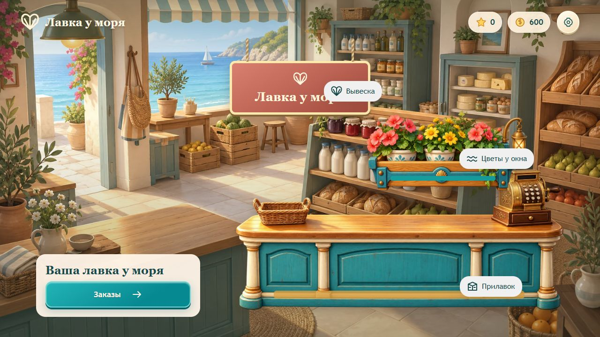

# Лавка у моря

Браузерная игра сортировки товаров. Версия **0.2.0**: десять заказов, три ремонта и финал «Лавка открыта!». Основной цикл и мастерская контента готовы; фактические проверки и оставшиеся задачи — в [QA.md](docs/QA.md).



Актуальный интерфейс: [главная на телефоне](docs/screenshots/shop-home-360.jpg), [осмотр на телефоне](docs/screenshots/shop-tour-360.jpg), [оформление](docs/screenshots/appearance-mobile.jpg).

## Запуск

Нужен Node.js 22.12+.

```sh
npm ci
npm run dev
```

Игра: http://localhost:5180. Мастерская: http://localhost:5180/author.html.

```sh
npm test
npm run build
npm run preview
```

Production preview: http://localhost:4173. Сервер должен оставаться запущенным; при занятом порте Vite остановится. Для публикации используется содержимое `dist`. Открытие HTML как файла не поддерживается: worker требует HTTP.

## Игра

Выбрать товар, затем свободное место, либо перетащить его. Три одинаковых товара на полке отправляются в заказ. Полоса «Запас» показывает количества товаров во всех скрытых рядах: следующий ряд раскрывается, когда передний полностью пуст. Замок открывается после нужного числа троек. В первой главе нет таймера и лимита ходов.

Только первый заказ обучает через затемнение «Возьми → Сюда» и ограничение кликов. При первом прохождении заказов 2–3, 7 и 9 золотая обводка мягко подсказывает товар, затем место переноса до победы: экран остаётся светлым, любые допустимые ходы доступны. Раскрытие первого ряда не завершает сопровождение. После самостоятельного хода или отмены следующий шаг проверяется заново. На четвёртом золотая рамка знакомит с бесплатной кнопкой помощи; ручные подсказки также обходятся без затемнения. Поддерживаются мышь, Pointer Events и Tab/Enter. Низкие окна прокручиваются, сохраняя размер поля.

Новая победа даёт 60 монет и одну звезду. Ремонты стоят 3 + 3 + 4 звезды; наград десяти заказов хватает на всю главу. После финала доступны осмотр лавки, бесплатная смена цвета и повторы. Подробные правила, помощь и экономика — в [GAME_DESIGN.md](docs/GAME_DESIGN.md).

Оформление переключается отчётливыми вкладками; цвет выбирается радиокнопкой с предпросмотром и сохраняется через «Применить цвет». Закрытие отменяет предпросмотр. В игре и мастерской минимальный размер текста — 16 px; на маленьком экране элементы перестраиваются и при необходимости прокручиваются.

После покупки ремонта или применения цвета открывается осмотр лавки; когда завершены все заказы и ремонты — финал. На телефонах и планшетах сцена занимает отдельную область над кнопками или слева от них: карточки не закрывают купленные предметы. «Моя лавка» доступна на главной после покупки вывески. При загрузке предметы сразу стоят на месте; нажатие подсказки и покупка резерва прокручивают игровое поле к соответствующему элементу.

Прогресс сохраняется локально. Разные host/port и браузеры имеют разные профили. Ключ `coastal-shop:progress:v1`, schema 2; старые сохранения мигрируют с сохранением закреплённой задачи. Для QA использовать отдельный origin, не сбрасывать пользовательский прогресс.

## Разработка и контент

- [HANDOFF.md](docs/HANDOFF.md) — состояние проекта и следующие задачи.
- [GAME_DESIGN.md](docs/GAME_DESIGN.md) — реализованные правила и технические ограничения.
- [CONTENT.md](docs/CONTENT.md) — добавление заказов, товаров и ремонтов.
- [QA.md](docs/QA.md) — результаты, размеры окон и непроверенные сценарии.
- [RELEASE.md](docs/RELEASE.md) — подготовка к платформенному выпуску.
- [AGENTS.md](AGENTS.md) — правила работы в репозитории, включая работу в `main`.

Глава закреплена в `src/levels/chapter.json`, каталог — в `src/content.ts`. `src/engine.ts` содержит правила и проверку решений; `src/generator.ts` — генератор coastal-slice-2. `src/storage.ts` отвечает за попытки, награды и миграции; `src/jobs.ts` и `src/worker.ts` — за поиск вне UI. `src/guidance.ts` выбирает режим обучения и считает скрытый запас; `src/hints.ts` сокращает проверенный путь помощи с повторным воспроизведением. Игровые экраны находятся в `src/main.ts` и `src/style.css`; мастерская — в `src/author.ts` и `src/author.css`.

Каждая сборка проверяет TypeScript, воспроизводит все решения главы и проверяет стоимость ремонта. Вся папка `dist`, включая worker и ассеты, должна быть меньше 80 000 000 байт. Отчёты: [контент](docs/content-report.json), [размер](docs/build-size.json). Дополнительная выборка генератора: `npm run content:audit`, [отчёт](docs/generator-report.json).

Все runtime-ресурсы находятся в `public/assets`, исходные PNG — в `docs/art`, исходные материалы — в `docs/reference`. Для сборки не нужны Python, прежний чат, папки Codex или внешний сервер. Необязательная перепаковка изображений описана в [ASSETS.md](docs/art/ASSETS.md).

С `?playtest=1` настройки позволяют скачать последние 1000 событий текущей загрузки страницы. Журнал хранится в памяти и не отправляется в сеть. SDK, реклама, платежи и облако подключаются отдельными этапами.
